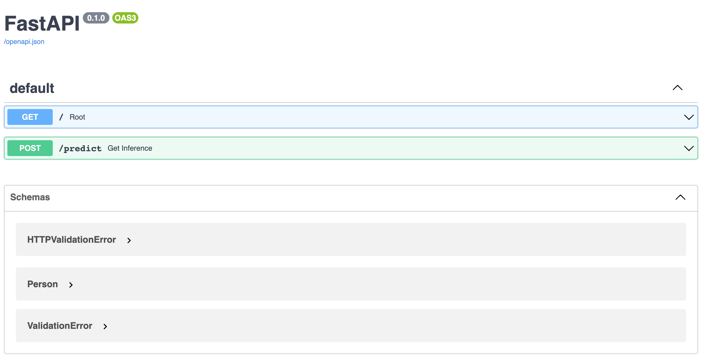
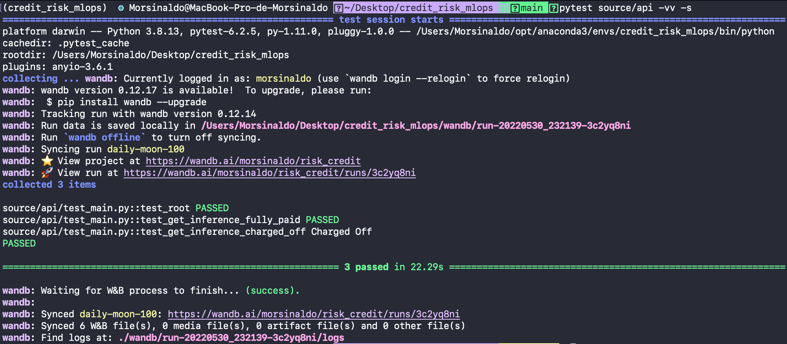

# Credit Risk MLOPs

## Introduction
Credit risk is something that can generate large profits or large losses depending on the size of the risk. So, to try to mitigate the risk of investors losing money, a machine learning model was created that predicts whether a person will pay back the loan on time or not. Obviously, the model is not 100% accurate, and is even a problem involving ethical issues, since a person could pay the loan strictly on time, even if the algorithm has predicted that he or she would not pay. So the model created is only for didactic and scientific purposes.

The data consists of approved loans from 2007 to 2011 from [Lending Club](www.lendingclub.com), a personal loan company that matches borrowers with people who want to lend money to get a financial return on it. The dataset contains 42537 rows and 52 columns and is available on both the github directory and the [Kaggle](https://www.kaggle.com/datasets/samaxtech/lending-club-20072011-data) website.

## Model Card

The model was deployed to the web using the FastAPI package and API tests were created. The API tests will be embedded in a CI/CD framework using GitHub Actions. After we built our API locally and tested it, we deployed it to Heroku and tested it again live. Weights and Biases were used to manage and track all artifacts.


So, in general, the notebooks used were divided into 7 parts:

  1. The search for data
  2. Exploratory analysis
  3. Pre-Processing
  4. Tests
  5. Splitting the data between training and testing.
  6. Training
  7. Test

You can read more about the notebook walkthrough in our [Medium](https://medium.com/@alessandro.pereira.700/from-classic-models-to-production-models-8d4ab873ac4d) article

## Anaconda Environment

Create a conda environment with ``environment.yml``:

```bash
conda env create --file environment.yml
```

To remove an environment in your terminal window run:

```bash
conda remove --name myenv --all
```

To list all available environments run:

```bash
conda env list
```

To activate the environment, use

```bash
conda activate myenv
```

## Fast API

The API is implemented in the ``source/api/main.py`` whereas tests are on ``source/api/test_main.py``.

For the sake of understanding and during the development, the API was constanly tested using:

```bash
uvicorn source.api.main:app --reload
```

and using these addresses:

```bash
http://127.0.0.1:8000/
http://127.0.0.1:8000/docs
```

The screenshot below show a view of the API docs.

<center></center>

For test the API, please run:

```bash
pytest source/api -vv -s
```

<center></center>

## Heroku

1. Sign up for free and experience [Heroku](https://signup.heroku.com/login).
2. Now, it's time to create a new app. It is very important to connect the APP to our Github repository and enable the automatic deploys.
3. Install the Heroku CLI following the [instructions](https://devcenter.heroku.com/articles/heroku-cli).
4. Sign in to heroku using terminal
```bash
heroku login
```
5. In the root folder of the project check the heroku projects already created.
```bash
heroku apps
```
6. Check buildpack is correct: 
```bash
heroku buildpacks --app risk-credit-mlops
```
7. Update the buildpack if necessary:
```bash
heroku buildpacks:set heroku/python --app risk-credit-mlops
```
8. When you're running a script in an automated environment, you can [control Wandb with environment variables](https://docs.wandb.ai/guides/track/advanced/environment-variables) set before the script runs or within the script. Set up access to Wandb on Heroku, if using the CLI: 
```bash
heroku config:set WANDB_API_KEY=xxx --app risk-credit-mlops
```
9. The instructions for launching an app are contained in a ```Procfile``` file that resides in the highest level of your project directory. Create the ```Procfile``` file with:
```bash
web: uvicorn source.api.main:app --host=0.0.0.0 --port=${PORT:-5000}
```
10. Configure the remote repository for Heroku:
```bash
heroku git:remote --app risk-credit-mlops
```
11. Push all files to remote repository in Heroku. The command below will install all packages indicated in ``requirements.txt`` to Heroku VM. 
```bash
git push heroku main
```
12. Check the remote files run:
```bash
heroku run bash --app risk-credit-mlops
```
13. If all previous steps were done with successful you will see the message below after open: ```https://high-income-app.herokuapp.com/```.
14. For debug purposes whenever you can fetch your app’s most recent logs, use the [heroku logs command](https://devcenter.heroku.com/articles/logging#view-logs):
```bash
heroku logs
```

## About Us
I (Morsinaldo Medeiros) and Alessandro Neto are students of the Postgraduate Program in Electrical and Computer Engineering (PPgEEC) at the Federal University of Rio Grande do Norte (UFRN). As the first project of the EEC1509 — Machine Learning discipline, we took a classic machine learning model and adapted it to a pipeline, which contains good standardization practices in order to put the created model into production.

## References

https://www.kaggle.com/datasets/samaxtech/lending-club-20072011-data  
https://app.dataquest.io

